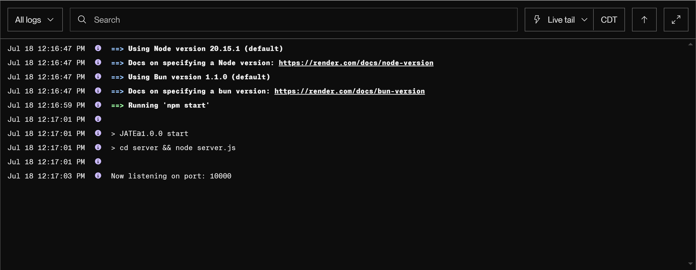

# Challenge-19-Progressive-Web-Application--PWA--Text-Editor-Dia-Jubara

  > # A Progressive Web Application (PWA) Text Editor

  > 

  > ## Table of Contents

  1. [Description:](#description)
  2. [Installation:](#installation)
  3. [Usage:](#usage)
  4. [How to Contribute:](#how-to-contribute)
  5. [License Agreement:](#license-agreement)
  6. [Test Instructions:](#test-instructions)
  7. [Questions:](#questions)

  > ## Description

  This is a text editor that runs in the browser. The app will be a single-page application based on PWA architecture. Additionally, it will feature a number of data persistence techniques that serve as redundancy in case one of the options is not supported by the browser. The application will also function offline.

> ## User Story

## User Story

```md
AS A developer
I WANT to create notes or code snippets with or without an internet connection
SO THAT I can reliably retrieve them for later use
```

## Acceptance Criteria

```md
GIVEN a text editor web application
WHEN I open my application in my editor
THEN I should see a client server folder structure
WHEN I run `npm run start` from the root directory
THEN I find that my application should start up the backend and serve the client
WHEN I run the text editor application from my terminal
THEN I find that my JavaScript files have been bundled using webpack
WHEN I run my webpack plugins
THEN I find that I have a generated HTML file, service worker, and a manifest file
WHEN I use next-gen JavaScript in my application
THEN I find that the text editor still functions in the browser without errors
WHEN I open the text editor
THEN I find that IndexedDB has immediately created a database storage
WHEN I enter content and subsequently click off of the DOM window
THEN I find that the content in the text editor has been saved with IndexedDB
WHEN I reopen the text editor after closing it
THEN I find that the content in the text editor has been retrieved from our IndexedDB
WHEN I click on the Install button
THEN I download my web application as an icon on my desktop
WHEN I load my web application
THEN I should have a registered service worker using workbox
WHEN I register a service worker
THEN I should have my static assets pre cached upon loading along with subsequent pages and static assets
WHEN I deploy to Render
THEN I should have proper build scripts for a webpack application
```

  > ## Screenshots


> ## Demo Gif


> ## Render Logs



  > ## Installation

  1. Clone Repository. GitHub repo contains application code
  2. Deploy the application to Render to get a live URL with build scripts

  > ## Usage

  Text Editor
  
  > ## How to Contribute

  Create a pull request or raise an issue.
  
  > ## License Agreement

 Subject to MIT Licensing terms and conditions.

  > ## Test Instructions

  There are no applicable tests
  
  > ## Questions

  If you have any question please visit my GitHub at (<https://github.com/djubara>) or send an email to <djubara@hotmail.com>
